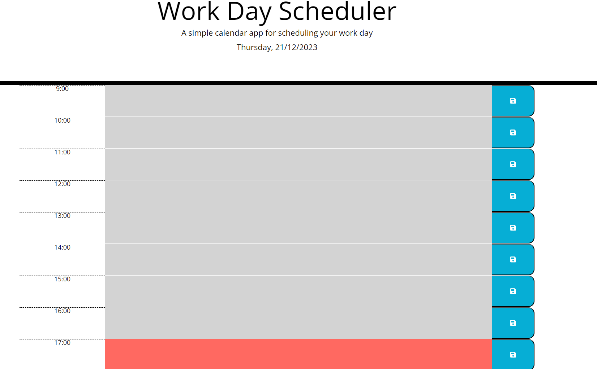

# Week 7 Daily Planner Challenge
## Description
The aim of this project was to make an application that would function as a simple daily planner, showing past, present and current events through colour-coding and allowing the user to put their own text in that would stay even if the page was refreshed. This was done by building on the given starter code, using dayjs to get the current date and time.

## Installation
Application deploys at live URL Link: https://ccc7321.github.io/Day-Planner-App/

## Usage
The website deploys from the link above.

## License
MIT License

## Credits
I completed this work on my own, with the use of the resources listed below.

## Resources
